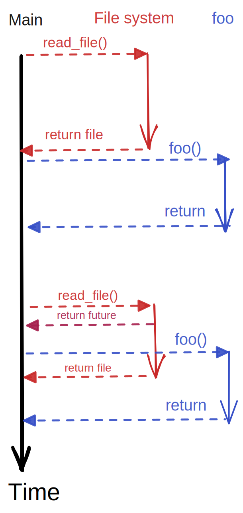

# Async/await 


## Introduction


### Definitions

**Future**  
A `Future` represents a value that is not available yet. Instead of waiting untile the value is available, futures make it possible to continue execution until the value is **needed**. 

**Note**
- A `Future` doesn't return anything until it's awaited -- they are **lazy**; 

```rust
use std::future::Future;

/// This 
async fn foo1() -> usize{ 0 }
/// gets turned into this
fn foo2() -> impl Future<Output = usize> {
    async { 0 }
}


fn main() {

    let f /* this is a Future, not usize*/ = foo1();
}
```

To wait for a `Future` use
```rust
f.await;
```

**Executor**  
An executor takes a set of `Future`s and calls the `poll` method on them whenever they can make progress.  
A `Future` indicates they are ready to make progress when they call `wake()`. After that they will be placed in a queue and wait to be `poll`ed again. This is done because polling to often would waste cpu cycles and starve other tasks. 

Usually they implement 2 key APIs
1. `block_on` -- runs a future to completion on the current thread (blocks any other activity)
2. `spawn` -- runs a future without blocking, returning immediately

**Runtime**  
A runtime has an executor for running futures, ways to interact with the OS, has a library of traits, types functions for async IO

### Rust
[The future trait](https://doc.rust-lang.org/std/future/trait.Future.html)
```rust
pub trait Future {
    /// type of the asynchronous value
    type Output; 
    ///  method that allows to check if the value is already available
    fn poll(self: Pin<&mut Self>, cx: &mut Context<'_>) -> Poll<Self::Output>;
}
```

[The Poll enum](https://doc.rust-lang.org/stable/std/task/enum.Poll.html)
```rust
enum Poll<T> {
    Ready(T), // When the value is already available
    Pending, // 
}
```

The purpose of `cx` is to pass a `Waker` instance to the async task. This `Waker` allows the asynchronous task to signal that it (or a part of it) is finished.

### Mental model

```rust
let f = read_expensive_stream();
let x = loop { 
    // Check if we finished
    if let Some(result) = f.try_check_completed(){
        break result;
    else{
        // Try to progress the future
        f.try_make_progres();
        yield;
    }
    }
};
```
But under the hood, this is a smart `loop` that only tries to check if it's completed or tries to make progress only if the "state changes" -- In other words, the tread "goes to sleep" and wakes up only if the stream notifies if some new information can be delivered / progress can be made.


### State machine mental model
What the compiler does behind this scenes is to transform the body of the async function into a state machine, with each `.await` representing a different state.

If we are waiting for a `Future`  we stay in same state and when it's ready we move to the next state.

**Note**
- Since `Future`s keep their internal state one should be careful when passing them around since this can lead to many `memcpy`s and a decrease in performance.
- However if we are using the executor's `spawn` method we are only keeping a pointer to the data therefore copying less data. 

### Selecting 
```rust
let network = read_from_network();
let terminal = read_from_terminal();

// There are macros / functions that can wait on multiple Futures
// and execute code when one finishes
// another name can be `race` since the futures race for which one finishes first. 
select!{
    stream <- network.await => {
        // do something on stream
    }
    line <- terminal.await => {
        // do something on stream
    }
}
```
`await` can be viewed as a way to check / ask for progress. The owner can decide to never await on the future therefore the future would never run. 

**Warning**
- If one case in the select completes the others will not be awaited to complete (the select will end). Therefore you need to manually call the other's `await` to finish it. If you forget, it will never be awaited to completion.
  
**Use Case**
- Async is useful to do stuff when waiting for information to be read (Ex: do X while waiting for Y to be read from the disk).

### Who executes the executor?
Since awaiting and executing is a hierarchical process and an async call must be in an async function intuitively there should be some executor that must check the function at the top (`main`).

There is a global executor that interacts with the OS and tells the OS to wake the it up when some state changes (state = something that we await on).

```rust
async foo(){}

/// `async main` doesn't work in normal rust so we have to wrap it into a runtime.
#[tokio::main]
async fn main(){
    let f = foo();
    // extra stuff
}
/// gets tranformed into something like
fn main(){
    let runtime = tokio::runtime::Runtime::new();
    runtime.block_on(async {
        let f = foo();
        // extra stuff
    });
}
```


### Stack variables
Where do we save stack variables? If we use state machine mental model then variables need to outlive the states they are "created" in. Behind the scenes the rust compiler will generate some structs that will keep the variables that are needed for other states.

```rust
// Compiler generates something like a state machine
enum StateMachine{
    Chunk1{x, f} // we are saving here variables that are used in other chunks
    Chunk2{}
}

#[tokio::main]
async fn main() {
    // Chunk 1 -- state 1
    {
        let mut x = [0; 1024]; // where is this stored? This shouldn't drop here since it's used in other chunks
        let z = [1; 1024]; // This can drop here
        let f = tokio::fs::read_into("file.dat", &mut x[..]);
    }

    // f.await -- edge (where f completes)

    // Chunk 2 -- state 2
    {
        let n = f.output();
        println!("{:?}", x[..n]);
    }
}
```

**Async traits**  
```rust
struct Request;
struct Response;

trait Service {
    async fn call(_: Request) -> Response;
    // which is just
    //fn call(_: Request) -> impl Future<Output = Response>;
}

// What is the size of `x` here?
// We can't know since we don't know the size of the Future state
fn foo(x: &mut dyn Service) {
    let f = x.call(Request);
}

// Well it depends
struct X;
impl Service for X {
    // Here It is very small since we don't need to save anything
    async fn call(_: Request) -> Response {
        Response
    }
}

struct X;
impl Service for Y {
    // But here we need to keep track of `z` and the size is bigger
    async fn call(_: Request) -> Response {
        let z = [0; 1024];
        tokio::time::sleep(100).await;
        drop(z);
        Response
    }
}
```

Solution:  
We can store our future as a heap allocated dynamically dispatched future which rust knows how to work with.
```rust
fn call(_: Request) -> Pin<Box<dyn Future<Output = Response>>>;
```
- $+$ This will work
- $-$ You are heap allocating all the futures and dynamic dispatching them => No rust optimizations
- $-$ If it's a frequently called function (like `read`) it can become expensive to fetch from heap each time.

## More resources
- https://os.phil-opp.com/async-await/
- https://ncameron.org/blog/what-is-an-async-runtime/